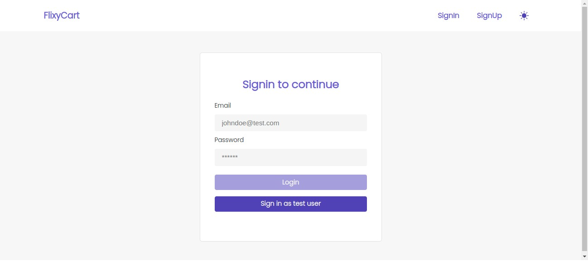

[](https://github.com/Debarshi95/FlixyCart/actions)

# FlixyCart

A ReactJS ecommerce web app for books.

## Demo

### Frontend

[Deployed on Netlify using github actions](https://debarshib-flixycart.netlify.app)

### Backend

[Deployed on heroku](https://github.com/Debarshi95/FlixyCartBackend)

## Features:

- Products listing of latest books
- Authentication facility for old & new users
- Wishlist and Cart functionality
- Authenticated users can add, update, remove, edit books in cart
- Authenticated users can add, update, remove, edit books in wishlist
- Filtering of items base on
  - Price
  - Category
  - Ratings
  - Price Slider
- LazyLoading/Code-splitting of components to dynamically load at runtime
- Error management using ErrorBoundary to catch and show fallback UI.
- LazyLoading/Code-splitting of components.
- Day/Night theme toggle
- Uses mongodb, JWT for data persistence and authetication
- Responsive UI for all screens (Desktop, Tablet, Mobile)

## Built using:

- [ReactJS](https://reactjs.org/) - Frontend framework
- [React Router](https://reactrouter.com/) - For routing & navigation
- [React-Hot-Toast](https://react-hot-toast.com) - to show Toast Notifications
- [Formik](https://formik.org/) - For form handling
- [Axios](https://www.npmjs.com/package/axios) - Network request
- [SAS](https://sass-lang.com/) - UI styling
- [Yup](https://www.npmjs.com/package/yup)- Form validation

## Screenshots

#### Desktop





<br/>

#### Mobile

<br/>
<div align="center">


</div>

## Run Locally

- Clone the project
  `git clone https://github.com/Debarshi95/FlixyCart.git`
- Go to the project directory
- cd flixycart
- Install dependencies
  `yarn`
- Create a **.env** file

```
REACT_APP_BASE_URL="Backend base url"
```

- Start the server
  `yarn start`
